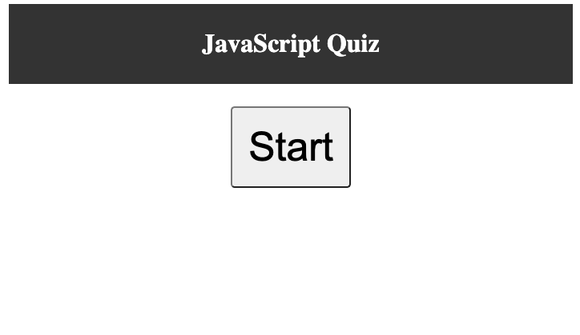
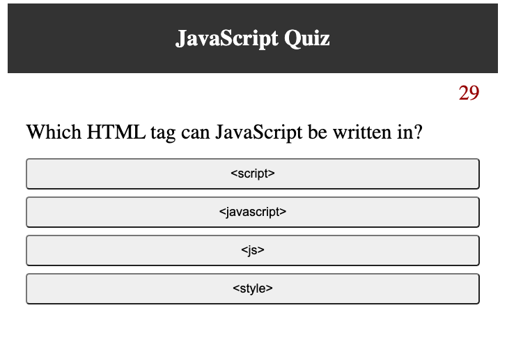
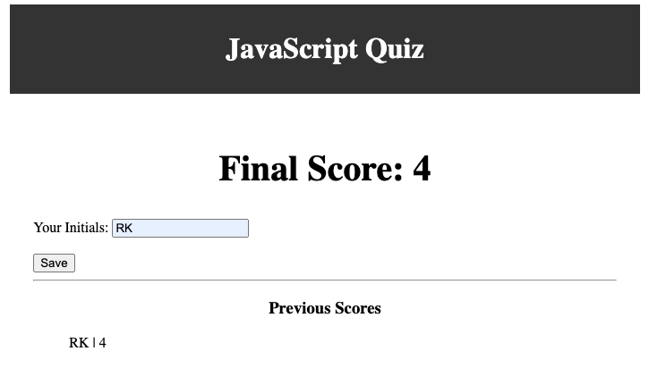

A short, timed quiz about JavaScript created using HTML, CSS, and JavaScript. 

## Taking the Quiz
 When the user presses start, the 45 second timer begins and they are presented with the first question.  If they select the correct answer, their score is increased by 1. If they select the incorrect answer, the timer decreases by 10 seconds.  In both cases, the user is then presented with the next question.  When all 6 questions are answered or the timer runs out, the quiz ends and the user can input their initials to be saved with their final score.  

## Screenshots of the quiz

## Deployable link
https://rekroetch.github.io/code_quiz/